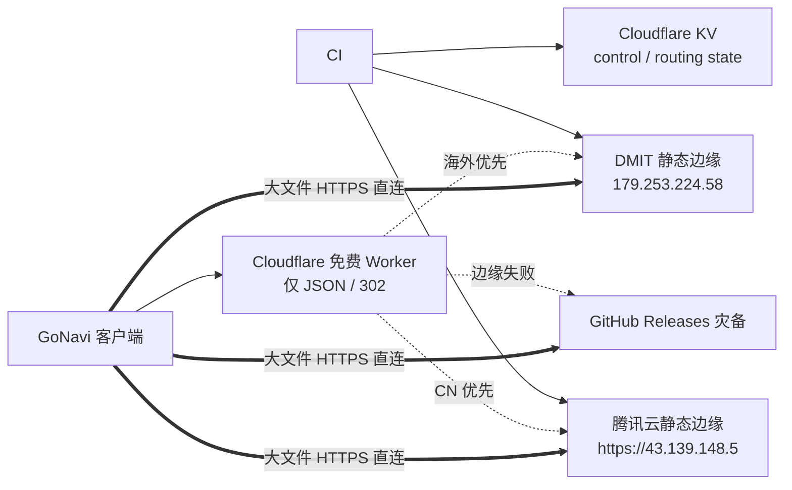
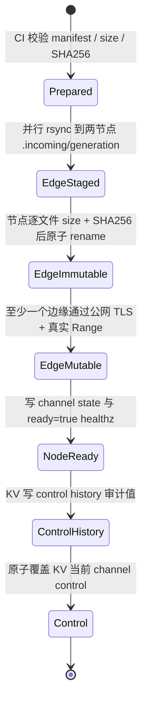

# GoNavi 免费透明下载调度与双边缘发布

## 生产拓扑

- `download-dispatch.syngnat.top` 使用 Cloudflare 免费代理承载 Worker，只返回小型 JSON 或 `302`，绝不读取或转发文件体，也不依赖付费 Load Balancer。
- `download.syngnat.top` 以 DNS-only 方式直连 DMIT，保留旧客户端兼容，同时由 DMIT 本地 `/srv/gonavi-downloads` 直接提供静态文件，不再实时反代 GatewaySentry；禁止让 Cloudflare HTTP 代理承载大文件体。
- 腾讯节点不绑定域名，唯一下载端点是 `https://43.139.148.5/...`，静态根为 `/srv/gonavi-cdn/public`。
- GatewaySentry `157.254.234.28` 只作为产物生产和首轮同步来源，不进入 Worker 候选，用户请求不得实时回源到它。
- GitHub Releases 是两边缘之后的唯一灾备候选。Cloudflare R2 已彻底废弃，原 `gonavi-downloads` 空桶已永久删除，当前 R2 overview 为未创建存储桶、0 B；新链路无任何 R2 读取、写入、保留或控制依赖。

## 发布状态机

代际格式为 `<channel>-<github.run_id>-<github.run_attempt>`。`tools/prepare-vps-release-payload.py` 生成同一份 `deployment.json` 和 `SHA256SUMS`，两个节点不得自行重建元数据。`tools/edge-release-transaction.py` 的顺序固定为：

1. `verify`
2. `promote-immutable`
3. 公网 HTTPS Range 验证
4. `promote-mutable`
5. `finalize`

一个节点失败不会阻塞另一个节点和本次 release，但失败节点不会出现在 control 的启用集合。至少一个边缘必须完整激活，否则 workflow 失败；GitHub 始终保留为灾备。失败节点补齐时重跑发布或执行同一事务，重新通过完整校验和健康恢复门槛后才能加入。100 MiB/8 路吞吐测试只写观测日志和低速告警，不改变 `ready`、不阻断发布，也不改变区域首选。

`control:<channel>` 是最后一个可见指针，直接保存在 Worker 的 `ROUTING_STATE` KV namespace；`routing:<channel>` 健康状态使用同一 namespace 的独立 key。新代际出现时 Worker 会立即清除旧代际健康继承；边缘需连续 2 次成功才启用，已健康边缘连续 3 次失败即摘除。Cron 每 5 分钟执行一次；健康状态超过 12 分钟没有刷新时 fail closed。正常运行时首次启用约需 5–10 分钟，连续故障摘除约需 10–15 分钟；若 cron 停止，最后状态最多保留 12 分钟。Workers KV 是最终一致存储，控制值传播到不同网络位置可能最多约 60 秒，因此发布与回滚不应假设全球瞬时生效。该延迟与免费健康抑制窗口都不依赖 DNS TTL 或付费 LB。参考 [Cloudflare KV 写入一致性说明](https://developers.cloudflare.com/kv/api/write-key-value-pairs/)。

KV Free 当前额度为每日 100,000 次读取、1,000 次写入和 1 GB 存储，UTC 00:00 重置。5 分钟 cron 对 stable/dev 分别写一个 routing key，基础写入量为 `288 × 2 = 576` 次/日；每次发布再写 history/current control 共 2 次，保留 424 次/日的发布与运维余量。不得将 cron 恢复为每分钟，否则仅健康状态就会达到 2,880 次/日并使后续写入失败。额度依据见 [Cloudflare Workers KV Pricing](https://developers.cloudflare.com/kv/platform/pricing/)。

## Worker 与客户端行为

Worker 同时验证：

- 公共 HTTPS 证书正常通过系统信任链验证；
- `/healthz` 返回 `status=ok`、`ready=true`，且目标 channel generation 与 control 相同；
- control 指定的真实 immutable 文件返回 `206`，`Content-Range`、`Content-Length` 和总大小均正确。

CN 的 JSON 初始候选为腾讯、DMIT、GitHub；其他地区为 DMIT、腾讯、GitHub。区域来自 Cloudflare `request.cf.country`。只有严格 TLS、`ready`、generation 和真实 Range 均健康且 control 启用的边缘才进入列表。新客户端请求 JSON 后在后台自动测速选源，不提供节点 UI、测速入口或手工选择。

不理解 JSON 的旧客户端只能跟随 `302`，无法执行多候选测速。鉴于腾讯约 4 Mbps、DMIT 约 144 Mbps 的现场证据，Worker 对所有地区的 `302` 都优先选择健康 DMIT；DMIT 不健康时依次使用腾讯、GitHub。JSON 候选顺序与该兼容重定向策略相互独立。

客户端对 Worker 返回的健康候选并行执行真实 256 KiB Range 探测，正常校验 TLS（包括 IP SAN），并严格验证 `206`、`Content-Range`、`Content-Length` 和目标总大小。按 `TTFB + fileSize / sampleThroughput` 估算完成时间：区域首候选若不慢于实测最快值的 120%，仍保留区域偏置；否则选择实测最快。结果缓存约 6 小时，下载失败会使对应缓存失效，下一任务主动重测。

大文件选定源后将同一任务的 8 个分片固定到该源；失败时暂停剩余请求并统一切到下一候选。同一 manifest 路径和 size 下可保留已完成分片，最终仍必须通过 manifest 的 size 和 SHA256；元数据变化时丢弃临时文件。小文件或不支持严格 `206` 的下级源使用顺序下载。调度器 IP/域名变化只修改 control/Worker 配置，不需要发布新客户端。

## HTTP 与证书要求

两个边缘配置位于 `deploy/download-mirror/`：

- `dmit-caddy-site.caddy`：只声明 `download.syngnat.top` 的本地静态 site，根目录 `/srv/gonavi-downloads`；
- `tencent-ip-nginx.conf`：公共 IP SAN TLS，根目录 `/srv/gonavi-cdn/public`。

DMIT 现有 Caddy 2.6.2 独占 80/443，并在同一 Caddyfile 承载 `mihomo...`、`sub.syngnat.top` 和 AnyTLS 相关入口。禁止安装/启用 Nginx 抢占端口，也禁止替换整份 Caddyfile。`install-edge.sh dmit /srv/gonavi-downloads caddy deploy/download-mirror/dmit-caddy-site.caddy caddy` 只将片段暂存到 `/etc/caddy/conf.d/gonavi-download.caddy`；运维人员应备份现有 Caddyfile，在同一次受控编辑中仅移除旧 `download.syngnat.top` 实时反代块并加入 `import /etc/caddy/conf.d/*.caddy`，随后执行 `caddy validate` 再 reload。其余 host 必须保持原样。腾讯继续使用 `install-edge.sh tencent /srv/gonavi-cdn/public nginx deploy/download-mirror/tencent-ip-nginx.conf nginx`。

immutable 响应必须支持 HEAD、Range/206、稳定 ETag，并返回 `Cache-Control: public,max-age=31536000,immutable`；latest、latest-dev、driver index 和 healthz 使用 `no-cache`/`no-store`。80 端口只允许 HTTPS 重定向及 ACME 验证，不提供明文文件下载。

Let's Encrypt 的 IP 地址证书已正式可用，IP 证书必须使用约 6 天的 `shortlived` profile；Certbot 5.4+ 支持 webroot IP 证书，服务端需显式 deploy hook reload Nginx。参考 [Let's Encrypt GA 公告](https://letsencrypt.org/2026/01/15/6day-and-ip-general-availability.html) 和 [Certbot IP 证书说明](https://letsencrypt.org/2026/03/11/shorter-certs-certbot)。禁止自签名、跳过校验或以 HTTP/裸 IP 旁路 TLS。

腾讯节点当前已完成以下上线检查：

- 公网 TCP/443 已放行；
- Certbot 5.7.0 已签发公共可信 IP SAN 证书；
- systemd timer 每日三次续期，renew dry-run 已成功；
- 从本地、DMIT、Gateway 均能严格校验证书访问 `/healthz`；
- 内部真实文件 Range 已返回 HTTP/2 206 及正确 Range headers。

首轮同步已完成：304 个文件、3,321,696,538 bytes 大小一致；stable/dev app/driver 清单引用的 296 个资产、3,321,413,545 bytes 已全部通过 SHA256。腾讯公网套餐确认只有 4 Mbps；100 MiB、8 路 Range 的跨网实测为 3.71 Mbps（225.878 秒），节点 eth0 同期约 4.06 Mbps，对照 DMIT/Gateway 的同类实测为 127.98 Mbps（6.319 秒）。腾讯当前功能健康为 `ready=true`，性能状态为 limited；带宽不作为摘除条件。CN 新客户端虽然获得腾讯区域偏置，但当腾讯预计完成时间比 DMIT 慢超过 20% 时通常会自动选择 DMIT；旧客户端的 302 已直接优先 DMIT，不承受腾讯 4 Mbps 上限。

发布 action 对每个边缘执行最多 100 MiB 的 8 路 Range 观测，低于默认 20 Mbps 时输出 warning，但不隔离节点或阻断发布。`ready=true` 仍必须在 size/SHA256、公共可信 TLS、目标 generation 和真实 immutable Range 全部通过后由发布事务写入；性能 limited 可作为额外非门禁字段记录。

DMIT 也已完成同一批 304 文件同步与 296 个清单资产 SHA/size 校验，Caddy `download.syngnat.top` 已从 Gateway 实时反代切为本地 `file_server`。immutable、mutable、health 缓存语义和 Range 已验证，Sub2API 与 mihomo 订阅回归均为 HTTP 200。约 101 MB 资产的 8 路实测从切换前 127.98 Mbps（6.319 秒）提升到本地静态分发 144.12 Mbps（5.612 秒）；临时 staging 已清理，根盘剩余约 9.8 GB。Gateway 不再承接该域名的用户实时下载请求。

## 最小权限与 CI 契约

两个节点都使用独立 `gonavi-cdn` 用户和 SSH key。该用户只可写对应静态根下的 `.incoming`；正式文件、`.state`、`.transactions`、`healthz` 和 marker 都由 root 持有。仓库安装的 root-owned `/usr/local/libexec/gonavi-edge-transaction` 与 `gonavi-edge-retention` 是唯一 promote/清理边界，sudoers 只放行这两个经过路径、marker、checksum 和代际校验的命令。CI 不上传或覆盖服务端执行脚本，也不接受 root 密码。

SSH authorized key 应关闭 agent/port/X11 forwarding 和 PTY，并可额外限制 GitHub Actions 出口地址。`install-edge.sh` 不生成证书；腾讯缺少公共可信 IP SAN 证书时 Nginx 校验必须失败，DMIT 继续由既有 Caddy 自动证书流程管理。私钥和 token 只通过 Actions secrets 注入，日志仅记录节点名、generation 和脱敏错误。

R2 退役清理已完成：专用账户令牌 `GoNavi GitHub Actions R2` 已永久删除，GitHub 中旧 `R2_ACCESS_KEY_ID` 与 `R2_SECRET_ACCESS_KEY` Secrets 也已移除。仓库 workflow 不再引用这些凭据，后续不得恢复对象存储链路。

Repository/Environment secrets：

- `CDN_DMIT_SSH_HOST`, `CDN_DMIT_SSH_PORT`, `CDN_DMIT_SSH_USER`, `CDN_DMIT_SSH_PRIVATE_KEY`, `CDN_DMIT_SSH_KNOWN_HOSTS`
- `CDN_TENCENT_SSH_HOST`, `CDN_TENCENT_SSH_PORT`, `CDN_TENCENT_SSH_USER`, `CDN_TENCENT_SSH_PRIVATE_KEY`, `CDN_TENCENT_SSH_KNOWN_HOSTS`
- `CLOUDFLARE_ACCOUNT_ID`
- `CLOUDFLARE_KV_API_TOKEN`：发布流程专用，仅允许目标 namespace 的 Workers KV Storage Write
- `CLOUDFLARE_WORKERS_API_TOKEN`：调度器部署专用，仅允许目标 Worker、route 和 KV binding

Repository variables：

- `ROUTING_STATE_KV_ID`：Worker control 与健康状态共用的 KV namespace ID；key 分别使用 `control:*`、`control:history:*` 和 `routing:*`

## 上线、回滚与保留

上线顺序：

1. 用 Gateway 当前完整 `/srv/gonavi-downloads` 作为首轮来源，将相同文件同步到 DMIT 与腾讯 staging；不得配置实时反代。
2. 分别运行本地 SHA256/size 验证，确认两个节点的同路径 immutable 完全相同（首轮已完成）。
3. 用严格 TLS 从外部执行 `/healthz`、当前真实资产 Range 和最多 100 MiB/8 路吞吐；TLS、代际和 Range 是 `ready=true` 门禁，吞吐只记录告警。
4. 配置 KV 和 `download-dispatch.syngnat.top` Worker Custom Domain（由 Cloudflare 自动创建 DNS 与证书），手动运行 `Deploy Download Dispatcher`。
5. 设置全部 CI secrets/variables，再运行一次 dev 发布；观察 2 次连续成功健康采样后核对 CN/海外 JSON 候选顺序。
6. DMIT 的本地 Caddy 切换已完成；后续变更继续只管理 `download.syngnat.top` site，并回归 `mihomo...`、`sub.syngnat.top`、AnyTLS 相关既有入口，绝不启用 Nginx。

每次发布先写 KV `control:history:<channel>:<generation>` 审计值，再通过单次 PUT 原子覆盖 `control:<channel>`。发布 workflow 共享 `gonavi-download-publication` concurrency，避免 stable/dev 对边缘与 KV 并发写入。异常节点可立即以 `enabled=false` 从新 control 排除；Worker 会清除不匹配代际。仅恢复旧 control 不会让 generation 不匹配的边缘重新上线，完整回滚必须用保留的旧 immutable 与 mutable 内容重新执行一次受控发布/校验，生成新的恢复代际。DNS 不参与节点切换。

边缘清理只删除不被 stable/dev channel state 引用且超过 7 天的版本目录。腾讯默认镜像预算 45 GB、至少保留 2 GB 文件系统空闲；DMIT 默认镜像预算 9 GB、至少保留 2 GB 空闲（本轮清理 staging 后现场可用约 9.8 GB）。预算为节点级 action 输入，DMIT 不得套用腾讯的 45 GB 值。清理失败只报警并保留冗余文件，不影响发布指针。已删除的 R2 桶不参与任何保留或回滚流程。
